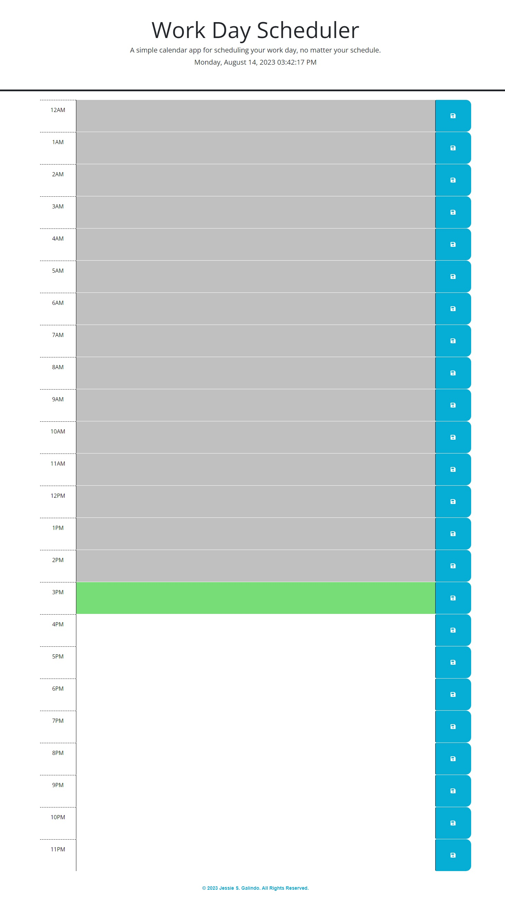

# Workday Scheduler

## Description

I was tasked with creating a working scheduling app where you can see the workday divided into hours with fields to write in events that you want to remember later in the day and be able to save it using the save button. I used a combination of jQuery functions, for loops, and day.js to make it recognize the time. A combination of regular CSS and bootstrap for appearance.

## Installation

No installation necessary but you can clone the [repository](https://github.com/MrMessyFace/workday-scheduler) from GitHub to edit it and make your own version.

## Usage

When a user loads the page, it automatically tells you the current date and time at the top of the page and it updates in real time. There are 24 blocks of text input, one for each hour of the day, that you can write in events you want to remember for that time of the day like meetings or appointments. The save button on the side allows you to save the event you typed in, keeping it there for you on your local device even when the page is refreshed. The current hour is highlighted in a light green and updates in real time. Hours that have passed are in a light gray while future hours are set in white. All hours are typable, not just current and future, so technically, it can also be used as a diary.

## Credits

Starter code was provided to me by the Northwestern University Full Stack Coding Bootcamp but color changes were made by me. A large portion of the JavaScript code was originally used by [codingprincess111](https://github.com/codingprincess111/Work-Day-Scheduler) but was polished by me with changes made to make the date, time, and highlighted hour update in real time. I found the code to update the time in real time via [Stack Overflow](https://stackoverflow.com/questions/13313348/jquery-update-time). I was able to update the styling of the time with Day.JS and updating highlighted hour without having the page blink every second with help from the TAs [Theo](https://github.com/Tward9) and [Jen](https://github.com/Jdoyle5254) during office hours.

## Helpful Links

- [Repository](https://github.com/MrMessyFace/workday-scheduler)
- [Live App](https://mrmessyface.github.io/workday-scheduler/)

&copy; 2023 Jessie S. Galindo. All Rights Reserved.
